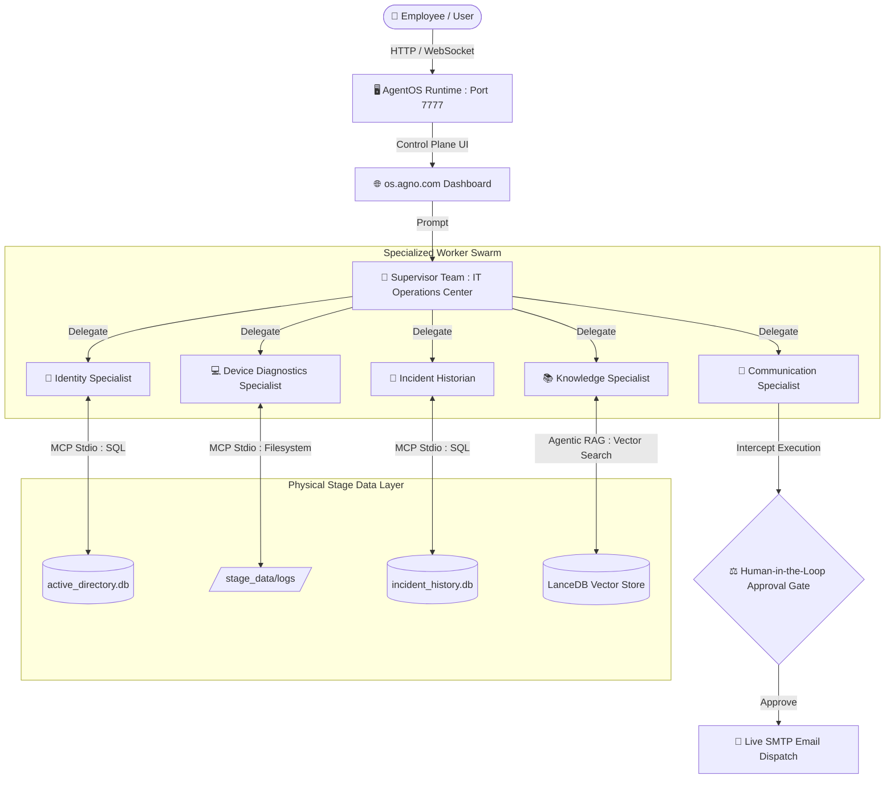

# 🏢 Autonomous Enterprise IT Operations Center
**An Enterprise-Grade Multi-Agent Swarm powered by Agno v2.0+, Model Context Protocol (MCP), Agentic RAG, and Human-in-the-Loop (HITL) Governance.**

---

## 📖 Overview
In modern enterprise environments, IT support tickets rarely live in a single system. Diagnosing an issue requires checking corporate identity directories, reading local endpoint crash logs, searching incident history, and consulting knowledge bases.

This repository demonstrates a **Multi-Agent Supervisor Swarm**: five specialized AI agents that collaborate autonomously to investigate issues, gather verification data, and recommend or take actions under HITL governance.

---

## 🏛️ System Architecture & Workflow



---

## 🤖 Agent Roster (high level)

| Agent Name | Primary Role | Underlying Technology | Data Source |
|---|---:|---|---|
| Supervisor Team | Orchestrates workflows, delegates tasks, synthesizes findings | Agno Team ReAct Engine | SQLite memory, runtime context |
| Identity Specialist | Query corporate identity, validate user contexts | MCP / SQL adapters | active_directory.db |
| Device Diagnostics Specialist | Collect & parse endpoint logs, run diagnostics | MCP / filesystem adapters | /stage_data/logs/ |
| Incident Historian | Find prior incidents and timelines | MCP / SQL adapters | incident_history.db |
| Knowledge Specialist | Vector search over runbooks & KB | Agentic RAG, LanceDB | LanceDB Vector Store |
| Communication Specialist | Draft and send notifications | SMTP bridge with HITL approval | SMTP (optional live dispatch) |

---

## Quickstart

1. Clone the repository

```bash
git clone https://github.com/lernwithshubham/agentic-it-center.git
cd agentic-it-center
```

2. Create a Python virtual environment and install dependencies

Option A (recommended, using uv):

```bash
uv venv
source .venv/bin/activate          # On Windows PowerShell: .venv\Scripts\activate
uv pip install -r requirements.txt
```

Option B (standard Python venv + pip):

```bash
python3 -m venv venv
source venv/bin/activate            # On Windows PowerShell: venv\Scripts\activate
pip install -r requirements.txt
```

3. Configure environment variables

Set your Google Gemini (or other model) API key:

macOS / Linux:

```bash
export GOOGLE_API_KEY="your_actual_gemini_api_key_here"
```

Windows (PowerShell):

```powershell
$env:GOOGLE_API_KEY = "your_actual_gemini_api_key_here"
```

(Optional) To enable live email dispatch in the Human-in-the-Loop demo, export SMTP credentials:

```bash
export SMTP_SENDER_EMAIL="your_email@gmail.com"
export SMTP_APP_PASSWORD="your_16_digit_app_password"
```

4. Bootstrap the enterprise environment

Run the automated setup script to create the SQLite databases, generate endpoint logs, write markdown runbooks, and initialize other demo artifacts. You should see a success message when bootstrap completes.

```bash
python scripts/bootstrap_demo.py
```

5. Run the AgentOS server (local)

```bash
python -m uvicorn main:app --host 0.0.0.0 --port 7777
```

You should see the AgentOS banner and Uvicorn reporting http://localhost:7777.

---

## 🎮 Live Walkthrough & Testing

Once the server is running you can interact with the control plane UI or use provided CLI/demo scripts to exercise the multi-agent workflows. The HITL approval gate will intercept any actions that would send real emails unless SMTP credentials are provided and approval is granted.

---

## Contributing

Contributions are welcome. Please open issues or pull requests for bug fixes, improvements, or documentation updates.

---

## License

This project is provided under the MIT License. See the LICENSE file for details.
